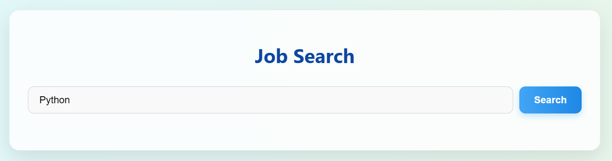
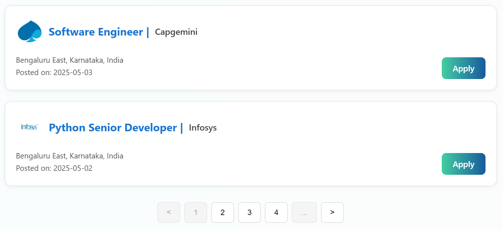
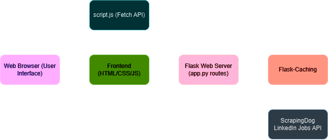

# 🔍 Tech Job Finder

**Tech Job Finder** is a Flask-based web application that helps identify companies actively using a specified technology stack by analyzing job listings. Users input a tech keyword (like `Python`, `Kafka`, or `Kubernetes`), and the app fetches job postings from LinkedIn (via the ScrapingDog API) and displays key job and company details in a clean, interactive interface.

---

## 🚀 Features

- 🔎 Search for jobs by tech stack (e.g., Python, Java, Docker)
- 📄 Fetch jobs using the ScrapingDog LinkedIn Jobs API
- 🧠 Displays job title, company name, logo, domain, location, and job posting date
- 📄 Paginated results with smooth client-side navigation
- 🚀 Caching enabled to reduce redundant API requests
- 🌐 Responsive UI built with HTML, CSS, and JavaScript

---

## 🛠 Tech Stack

- **Backend:** Flask, Flask-Caching, Requests
- **Frontend:** HTML, CSS, JavaScript
- **API Used:** [ScrapingDog LinkedIn Jobs API](https://www.scrapingdog.com/)

---

## 🚀 Live App

👉 [Click here to use Tech Job Finder](https://tech-job-finder.onrender.com)

---

## 🛠 Deployment

This app is hosted on [Render](https://render.com), automatically deployed from the GitHub repository.

---

## 🔐 API Key Handling

API key for the ScrapingDog LinkedIn Jobs API is stored securely using Render's environment variables.

---

## 📥 Input

---

## 📥 Output

---

## 📊 System Architecture

---

## System Explanation

This project is designed to identify companies using a given technology stack based on job postings.

- **Frontend**: A simple user interface (HTML, CSS, JavaScript) allows users to input a technology stack.
- **Backend**: The Flask app handles requests to fetch job listings from the ScrapingDog API and caches them.
- **Caching**: Caching is used to reduce redundant API calls and improve performance.
- **Job Data**: The app extracts job data and displays relevant details such as company name, domain, job title, and job link.

---

## Architecture

The system consists of:
1. **Frontend**: HTML, CSS, and JavaScript for a clean UI.
2. **Backend**: Flask server, which connects to the ScrapingDog API and returns job listings.
3. **Caching**: Using Flask-Caching for improved performance and reduced load.
